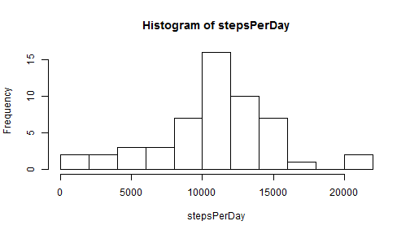
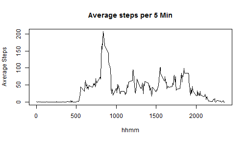
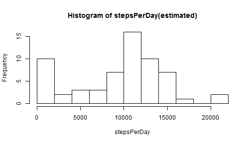
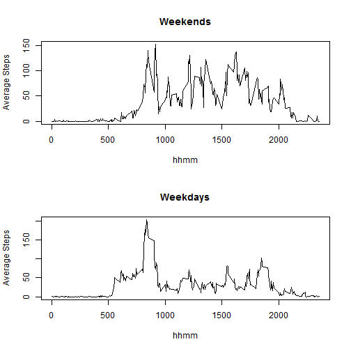

# Reproducible Research: Peer Assessment 1


## Loading and preprocessing the data
Let's unzip and read the data into data frame.

```r
activityData <- read.csv(unz("activity.zip", "activity.csv"))
activityData$hhmm <- with(activityData, sprintf("%02d:%02d", interval/100, interval%%100))
activityData$timestamp <- with(activityData, strptime(sprintf("%s %s", date, hhmm), "%Y-%m-%d %H:%M"))
```

## What is mean total number of steps taken per day?

```r
stepsPerDay <- tapply(activityData$steps, activityData$date, sum)
hist(stepsPerDay, breaks=10)
```

 

```r
meanSteps <- mean(stepsPerDay[!is.na(stepsPerDay)])
medianSteps <- median(stepsPerDay[!is.na(stepsPerDay)])
```
  
* Mean total number of steps per day: 10766
* Median total number of steps per day: 10765

## What is the average daily activity pattern?


```r
stepsPer5Min <- with(na.omit(activityData), tapply(steps, interval, mean))
plot(names(stepsPer5Min), stepsPer5Min, type="l", xlab="hhmm", ylab="Average Steps", main="Average steps per 5 Min")
```

 

```r
maxValue <- max(stepsPer5Min)
maxInterval <-names(which.max(stepsPer5Min))
```

* 5 minitues interval from 835 contains the maximum average number of steps 206.1698.

## Imputing missing values


```r
numNA <- sum(is.na(activityData))
```
* Total number of missing values in the dataset: 2304

We simply replace NA values with zeros and make histograms of the newly estimated data.  
We know this is not a very good estimate, but it is a good start point to show how the estimate impacts the results.

```r
activityData2 <- activityData
activityData2[is.na(activityData2$steps),][1] = 0
stepsPerDay2 <- tapply(activityData2$steps, activityData2$date, sum)
hist(stepsPerDay2, breaks=10, xlab="stepsPerDay", main="Histogram of stepsPerDay(estimated)")
```

 

```r
meanSteps2 <- mean(stepsPerDay2[!is.na(stepsPerDay2)])
medianSteps2 <- median(stepsPerDay2[!is.na(stepsPerDay2)])
```
  
* For the newly estimated data, mean total number of steps per day: 9354
* For the newly estimated data, median total number of steps per day: 10395

As we replaced NAs with zeros, the average number of steps decreased for more than 1400.

## Are there differences in activity patterns between weekdays and weekends?


```r
activityData2$isWeekend <- (as.POSIXlt(activityData2$timestamp)$wday %in% c(0, 6))
stepsPer5MinWeekends <- with(activityData2[activityData2$isWeekend == TRUE,], tapply(steps, interval, mean))
stepsPer5MinWeekdays <- with(activityData2[activityData2$isWeekend == FALSE,], tapply(steps, interval, mean))
par(mfrow=c(2,1))
plot(names(stepsPer5MinWeekends), stepsPer5MinWeekends, type="l", xlab="hhmm", ylab="Average Steps", main="Weekends")
plot(names(stepsPer5MinWeekdays), stepsPer5MinWeekdays, type="l", xlab="hhmm", ylab="Average Steps", main="Weekdays")
```

 
